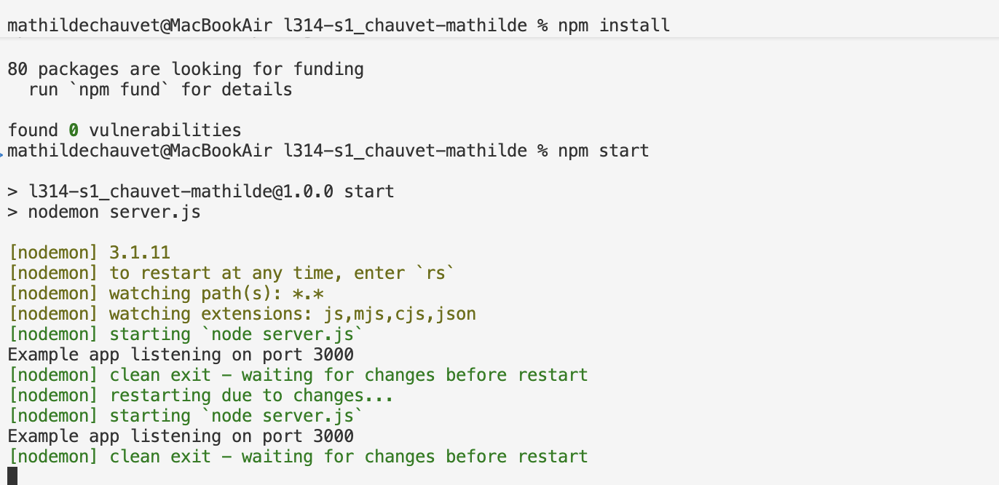
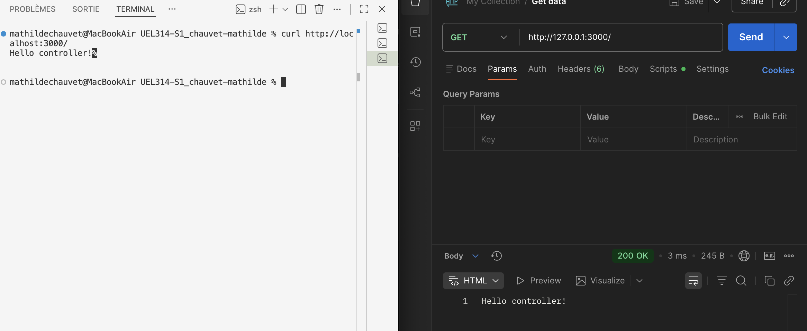
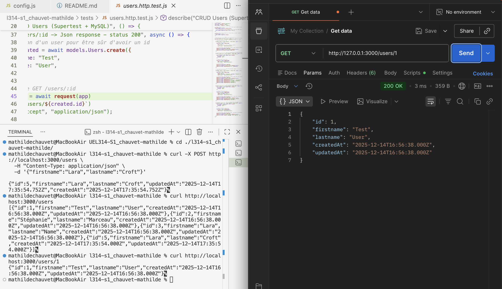
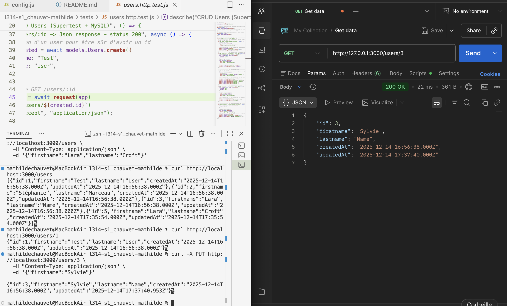
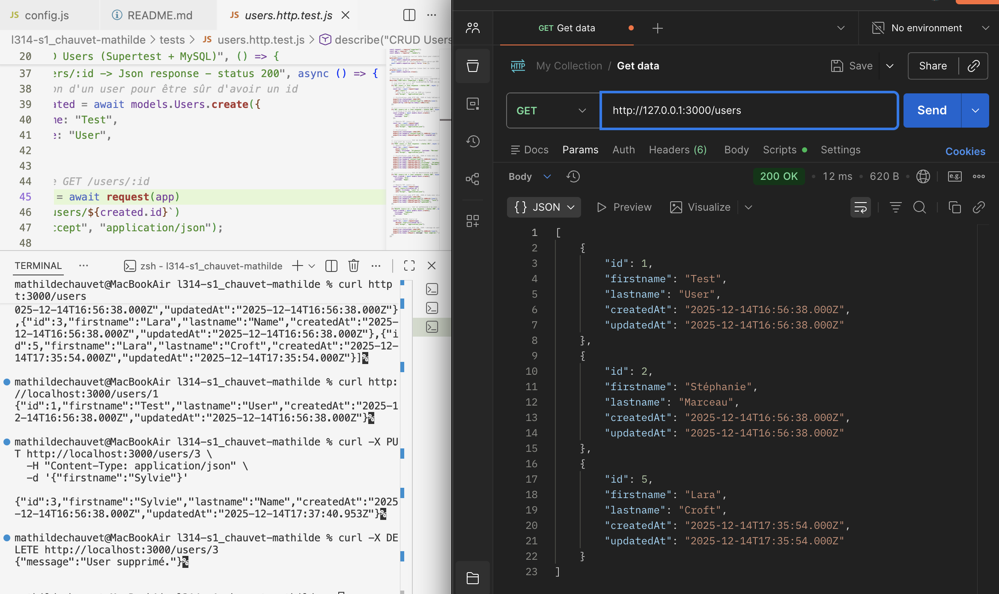
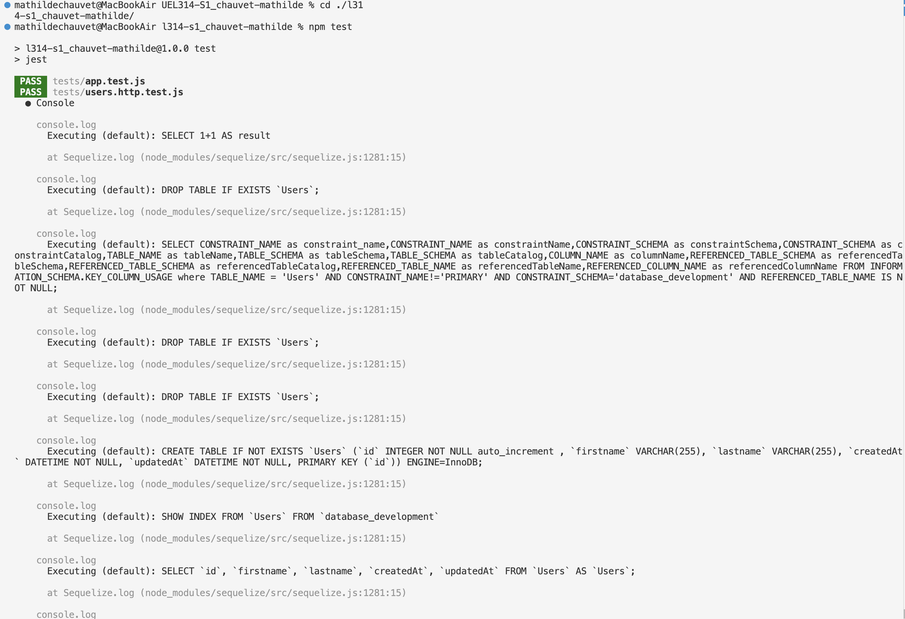
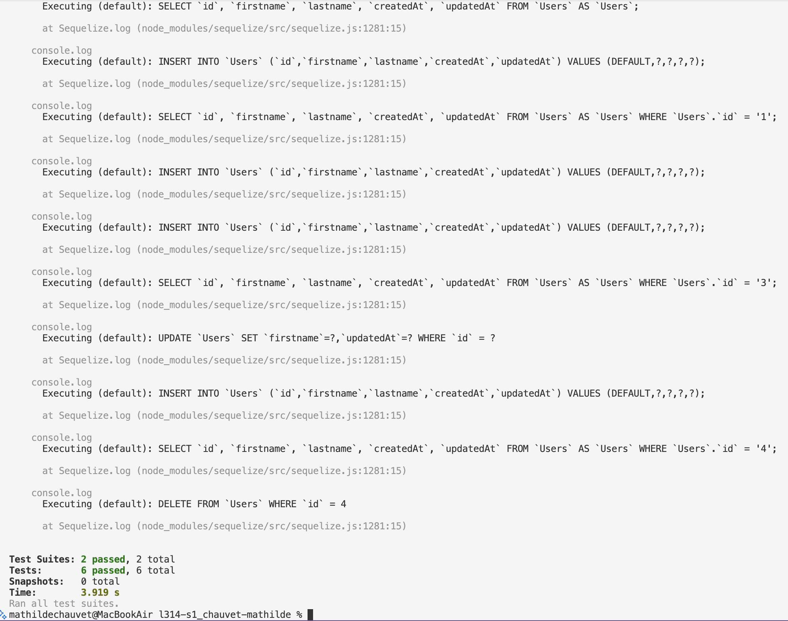

# UEL314-S1_chauvet-mathilde

UE L314 — Semaine 1 — API Users (Express + Sequelize + MySQL)
Initialisation projet - Développement Backend, création d'API avec NodeJs

API Node.js (Express) utilisant Sequelize + MySQL permettant un CRUD sur la ressource `Users`.

## Note importante concernant MySQL / .env

De mon côté, le projet fonctionne avec ma configuration MySQL locale (CRUD OK et tests OK).

Lors de tests sur une autre configuration, j’ai rencontré un problème de connexion MySQL dépendant de l’environnement, avec ce message :
"SequelizeConnectionError: Plugin 'mysql_native_password' is not loaded"
Votre phase de test de l'exercice ne sera peut être pas fonctionnelle.

## Technologies

- Node.js
- Express
- Sequelize
- MySQL / mysql2
- Jest / Supertest

## Fonctionnalités attendues (CRUD)

- Récupérer tous les utilisateurs : `GET /users`
- Récupérer un utilisateur via ID : `GET /users/:id`
- Créer un utilisateur : `POST /users`
- Modifier un utilisateur : `PUT /users/:id`
- Supprimer un utilisateur : `DELETE /users/:id`

### Champs `Users`

- `id`
- `firstname`
- `lastname`
- `createdAt`
- `updatedAt`

## Installation & Lancement API

1. Se placer dans le bon dossier :
   Après le `git clone`, se mettre dans le dossier du projet Node :
   cd l314-s1_chauvet-mathilde

2. Copier votre fichier `.env` à la racine du projet :
   `l314-s1_chauvet-mathilde`

3. Installer les dépendances :
   `npm install`

4. Lancer l'API :
   `npm start`

   

## Tests des fonctionnalités

1. Test de la route racine
   `curl http://localhost:3000/`

   

2. Créer un utilisateur
   `curl -X POST http://localhost:3000/users \`
   `-H "Content-Type: application/json" \`
   `-d '{"firstname":"Lara","lastname":"Croft"}'`

   

3. Récupérer tous les utilisateurs
   `curl http://localhost:3000/users`

   

4. Récupérer un utilisateur par son ID
   `curl http://localhost:3000/users/1`

   

5. Modifier un utilisateur
   `curl -X PUT http://localhost:3000/users/1 \`
   `-H "Content-Type: application/json" \`
   `-d '{"firstname":"Tomb Raider"}'`

   

6. Supprimer un utilisateur
   `curl -X DELETE http://localhost:3000/users/1`

   

## Tests unitaires des fonctionnalités

`npm test`

